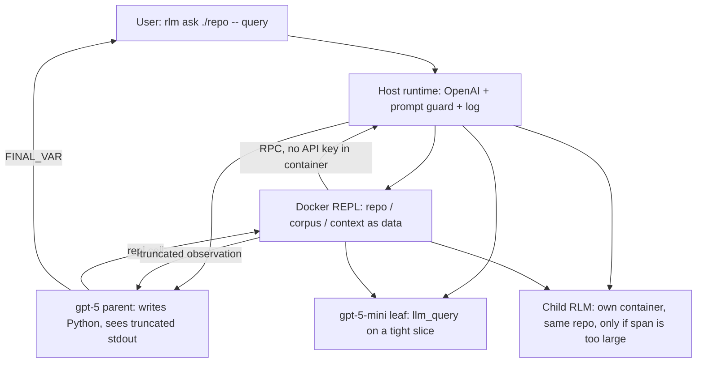
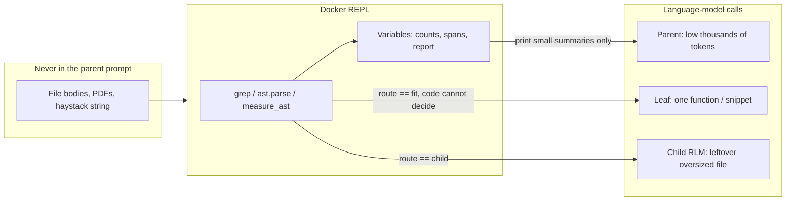
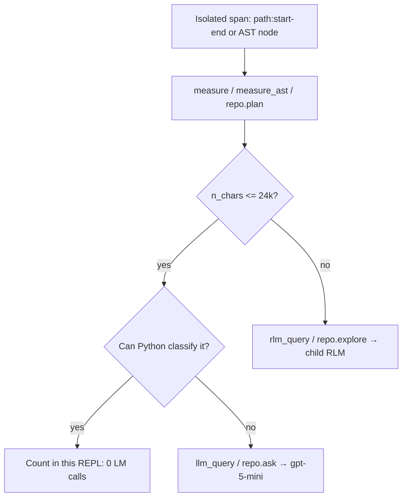

# Recursive Language Model

A **read-only census engine** for brownfield code and long documents: the source stays in a Docker Python REPL; the parent model never swallows the tree.

This is an inference-time **Recursive Language Model** (Zhang, Kraska, Khattab, [arXiv:2512.24601](https://arxiv.org/abs/2512.24601)). The runtime, CLI, and library wrap OpenAI. A repository, paper dump, or huge string is **data in a container**, not prompt text. The root model (`gpt-5`) sees a short manifest, writes Python, peeks with grep/`ast`, and calls cheaper leaves (`gpt-5-mini`) only on slices code cannot classify. Nested `rlm_query` children exist for spans that still overflow one leaf — not for “one child per file.”

It is **not** a coding agent. It does not patch, test, or commit. Use Codex / Claude Code to implement; use this to **ingest and understand** a mature tree without answering from training memory.

## Why this exists

Mature codebases and multi-paper corpora break the usual tricks:

| Approach | What goes wrong |
|---|---|
| Stuff the repo into a 100k–1M window | Cost scales with bytes; **context rot** still hits on dense aggregation |
| Rolling summaries | Early details that later matter are gone |
| RAG / BM25 | Retrieval is a guess; “every `*ForCausalLM.forward()`” is not a search query |
| ReAct + sub-agents | Tool traces are verbalized into the parent chat; the root still fills up |
| Coding agents (Claude Code, Codex, …) | They already *grep* large trees. They still **guess** when they did not look, compact the transcript, and mix this-repo facts with pretrained Hugging Face. Fine for edits; weak as a frozen, cited census |

The load-bearing difference:

1. **The prompt lives in the environment, not in `hist`.** The root is not given the repo.
2. **Findings live in variables.** `FINAL_VAR("report")` can return a table that never had to be printed into the window.
3. **Recursion is Python.** Maps and filters run in the REPL. An LM is called only when a *span* would leave the smart zone.

Coding agents already traverse huge repos. This product is for the part they still fake: **answers that are only allowed to come from this tree, and that survive past the next compaction.** Spec-driven development can use it as the step that connects a spec to the codebase and writes a **cited plan**. Implementation still belongs in an editor agent.

## How a query runs





Host vs container:

```
Host                                              Container (rlm-repl:0.1.14)
────                                              ─────────────────────────
RLM loop, OpenAI, OPENAI_API_KEY                  persistent Python, no key, no net
prompt guard (<100k tokens, ≤150 instructions)    /workspace mounted read-only
unix socket lm.sock  ◄── JSON RPC ──►             llm_query / rlm_query stubs
trajectory .rlm/logs/<id>/                        grep, ast, measure, plan_reads
```

## Routing: keep every LM in the smart zone

100k input tokens is a **hard stop**, not a target. The parent should sit in the **low thousands**. A typical `forward()` is one leaf (~24k chars / ~6k tokens), not a nested gpt-5 RLM.



| Signal | Meaning |
|---|---|
| `route == "fit"` | One leaf, or classify with `ast` here |
| `route == "child"` | Too big for one leaf; spawn a child **or** split into `n_chunks` leaves |
| `plan_reads` / `repo.plan` | `{n_fit, n_child, n_chunks}` over a list of spans |
| Parent fill (2k vs 8k of 100k) | **Not** used to pick N. Remaining window is the wrong meter |

`n_tokens` in the REPL is a **~4 chars/token** estimate (`tiktoken` is on the host, not in the image). Workload size (sum of file chars) is calculable; parent-prompt size is a different account.

## What the parent is told

System prompts and the token nudge say: grep/`ast` in this REPL; `llm_query` / `repo.ask` on unclear **fit** slices; `rlm_query` / `explore` only if a file is still too large. Do **not** write “one child per file” in the user query — that fights the runtime and turns a $0.10 census into a $15 map of gpt-5 children.

## Requirements

- Python 3.12+
- [uv](https://docs.astral.sh/uv/)
- Docker engine (the REPL never `exec`s model code on the host)
- `OPENAI_API_KEY` in the environment (or a gitignored `.env`)

## Install

```bash
uv sync --group dev
cp .env.example .env   # then put your key in .env
```

Build the REPL image on first real completion (or ahead of time):

```bash
docker build -t rlm-repl:0.1.14 -f docker/Dockerfile .
```

Bump this tag whenever `repl_ns.py`, `history.py`, or other files copied into the image change. `ensure_image` only builds if the tag is missing.

## Usage

```bash
uv run rlm ask ./pytorch -- "Where is autocast implemented, and how does it interact with bfloat16 on CPU?"
uv run rlm research ./papers -- "Where do these papers disagree about context rot?"
uv run rlm complete --context-file haystack.txt -- "Find the needle."
uv run rlm ask ./repo --dry-run -- "preview the manifest and prompt; no API, no container"
uv run rlm report .rlm/logs   # rebuild the static HTML timeline for the latest run
```

Repo-wide census (prefer this shape over “explore one file at a time”):

```bash
uv run rlm ask codebases/transformers --verbose -- \
  "Under src/transformers/models, for every class named *ForCausalLM or *ForConditionalGeneration: find forward() even if inherited. Classify loss-in-forward vs shift-in-forward vs loss_function helper. Return counts, exceptions only, and GenerationMixin classes that do not match those names. Use grep + ast. llm_query only on unclear bodies. Do not spawn one child per file."
```

Success for a huge tree: parent `prompt_tokens` in the low thousands, `subcalls` near zero (or a handful of `llm_query`s), answer cites `path:start-end`. Hundreds of `rlm_query` events means the parent ignored the strategy.

Python:

```python
from rlm import RLM, load_repo, load_corpus

rlm = RLM(verbose=True)
out = rlm.completion(query="Count mentions of La Union.", context=huge_string)
out = rlm.ask_repo(path="./pytorch", query="How does autograd handle views?")
out = rlm.research(path="./papers", query="Compare recursive vs compressive memory.")
print(out.response)
print(out.usage)
```

Config is **TOML or YAML** (`rlm.toml`, `rlm.yaml`, or `rlm.yml`). Same keys. Do not put both formats in the working directory. Auth is never in the file.

## Documentation

Full docs live in [`docs/`](docs/README.md):

| Topic | Doc |
|---|---|
| Install and first query | [Getting started](docs/getting-started.md) |
| Invariants, vs RAG/ReAct/coding agents | [Concepts](docs/concepts.md) |
| Host vs container | [Architecture](docs/architecture.md) |
| `ask` / `research` / `complete` / `report` | [CLI](docs/cli.md) |
| `RLM.ask_repo`, … | [Python API](docs/python-api.md) |
| TOML/YAML | [Configuration](docs/configuration.md) |
| Builtins, `measure` / `plan_reads`, Docker | [REPL](docs/repl.md) |
| `repo` / `corpus` | [Domains](docs/domains.md) |
| Loop, hist, prompt guard, routing | [Runtime](docs/runtime.md) |
| Trajectories, `error.txt` | [Logging and errors](docs/logging-and-errors.md) |
| Tests, layout | [Development](docs/development.md) |
| Harbor agent tasks, suites, and legacy judges | [Evaluations](docs/evaluations.md) |
| Package map | [Module reference](docs/module-reference.md) |

## When not to use this

- Short prompts: a single base-model call is often **better** (as in the paper).
- “Change this module and open a PR”: use a coding agent.
- A spec that already names eight files: grep in Claude/Codex is enough.
- Use this when the source would **overflow or rot** a normal window, or when the answer must be a **complete, cited** property of the tree.

## Tests

```bash
# Fast product-contract gate (no Docker or evaluation tooling).
uv run pytest -m "not docker and not eval_support and not harbor"

# All deterministic checks, including Harbor verifier and eval-support checks.
uv run pytest

# Daemon-backed RLM container checks.
uv run pytest -m docker
```

See [Development](docs/development.md) for the marker taxonomy. Docker tests
are skipped when the daemon is absent.

For the read-only Harbor agent benchmark task and its deterministic verifier
checks, see [Evaluations](docs/evaluations.md). Repository changes are tracked
in [CHANGELOG.md](CHANGELOG.md).

## License

[MIT](LICENSE)
